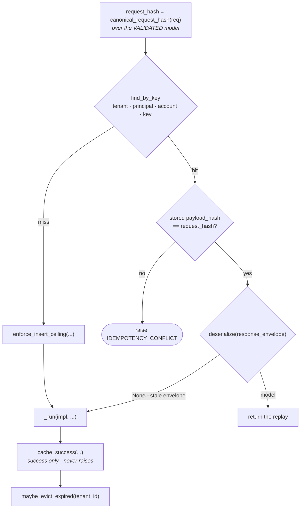

# Building a tool

This page is the how-to for adding or changing an AdCP tool in this codebase. It describes
the tree as it is, and it carries every decision the tree rests on, with the reason beside
each one. Read it top to bottom when you add a tool, and jump to a section when you change
one.

The system rests on a small number of seams, and each seam is the single place its concern is
decided. A tool is one registry row. One resolver identifies the caller. The boundary runs the
tool once, for every transport. A response becomes a body in one function. An error names a
code and supplies facts. Because there is one of each, a rule holds everywhere by
construction, and most of the checks that used to police agreement between copies are gone.

The codebase targets AdCP 3.1.1 through the `adcp` SDK. Companion pages:
[Architecture guide](architecture.md), [Request lifecycle](request-lifecycle.md),
[Patterns reference](patterns-reference.md), and [Structural guards](structural-guards.md).

## A tool is one registry row

You declare a tool once, in `src/core/tools/registry.py`, as a `ToolSpec` row keyed by its
AdCP tool name:

```python
    "get_products": ToolSpec(
        dto=GetProductsRequest,
        impl=_get_products_impl,
        rest=RestBinding("POST", "/products"),
    ),
```

A row carries four things:

- `dto`: the request model the transports validate into. The DTO says what the tool accepts,
  which is why the row holds a model rather than a description of one.
- `impl`: the function that runs. Its signature is the subject of a later section.
- `rest`: the REST binding, or `None` for a tool with no REST route.
- `a2a`: whether the A2A agent card advertises the tool. The default is `True`.

Everything else is derived from the row, so nothing can disagree with it. The following table
lists what each transport derives and from which part of the row.

| Derived | From |
|---|---|
| The MCP tool and its advertised JSON Schema | `spec.dto.model_json_schema()` |
| The A2A skill, agent-card entry, and dispatch | Iteration over `TOOLS` |
| The REST route and its documented request body | `spec.rest` and `spec.dto` |
| Whether a caller needs a credential | The `identity` annotation on `spec.impl` |
| Whether the boundary resolves an account | The `account` field on `spec.dto` |

There is no field for the credential policy and no field for the account policy. The row
used to carry an `auth` literal beside the implementation. A literal is a second statement of
a fact the implementation already states, and the two disagreed. The annotation and the DTO
are the policy, as [Policy is derived](#policy-is-derived-and-the-registry-checks-it)
describes.

### Registration refuses an incoherent row

`_register_tool` in `src/core/main.py` raises `RuntimeError` at import instead of registering a
row it cannot derive from. It refuses three rows:

- A request DTO that does not descend from the SDK's `AdcpVersionEnvelope`.
- A response model that does not descend from `AdcpResponse`.
- A DTO that does not inherit the SDK's request model, for a tool the pinned spec defines.

The `ToolSpec` constructor adds a fourth refusal, described under
[Policy is derived](#policy-is-derived-and-the-registry-checks-it). Each refusal replaces a
guard that reported the violation afterwards.

## What a tool declares: the DTO

A request DTO subclasses the SDK's pinned request model and adds nothing the spec does not
declare. The DTO carries the spec's whole vocabulary, and a field this seller does not
implement is unused rather than removed.

```python
class CreateMediaBuyRequest(BuyerRequest, LibraryCreateMediaBuyRequest):
```

`sdk_grounding()` proves a DTO carries the spec's fields by walking the live method resolution
order. That proof is why the DTO extends the SDK model rather than being rebuilt from it.

> Narrowing is fragile, and this note records why so nobody reattempts it. Popping from
> `model_fields` plus `model_rebuild(force=True)` narrows the class but does not survive
> subclassing. The popped fields return as required fields, because the pop destroyed their
> defaults. Narrowing also changes nothing a buyer can observe: production runs
> `extra="ignore"`, so an unimplemented field is ignored whether popped or unused.

### The accepted shape is the declared shape

`SalesAgentBaseModel` in `src/core/schemas/_base.py` sets `extra` from the settings object:
`forbid` outside production and `ignore` in production. `BuyerRequest` adds a `mode="before"`
validator, `_accept_only_declared_fields`, that calls `deep_strip_to_schema` in
`src/core/schemas/_accepted_shape.py`. That function is a recursive JSON Schema walk that
keeps only the fields the DTO declares, at every nesting depth. The following table gives the
outcome per environment.

| Environment | A field the models do not declare |
|---|---|
| Development and CI | Rejected, so an unimplemented spec field is loud |
| Production | Dropped, so a buyer sending a field from a later release is served |

The strip ignores `additionalProperties` on purpose. A pinned schema saying
`additionalProperties: true` is the spec permitting a sender to add fields. It is not an
instruction to this seller to carry them inward, because the DTO is what keeps the internal
models predictable. If the tool should accept a field, declare it on the DTO. That is the only
mechanism.

A free-form container such as `ext` or `context` keeps its contents. An object that declares
no properties is the schema's way of saying arbitrary data lives there. There is no
compatibility middleware and no coercion of legacy shapes on the models. A DTO is the pinned
schema, and a shape AdCP does not define is refused in development. Behaviour that depends on
the spec version the buyer speaks belongs in the implementation, which already holds
`req.adcp_version` and `req.adcp_major_version` as envelope fields.

### The account is a reference, never an id

No request DTO declares a top-level `account_id`. The pinned schemas declare `account`, whose
type is the SDK's `AccountReference`: a `oneOf` of a reference by id and a reference by
natural key. The boundary resolves that reference for the caller, and the tool reads the
result off the identity. `create_media_buy`, `update_media_buy`, and `sync_creatives` declare
`account` as required; `get_media_buys` declares it as optional.

### Envelope fields and request fields

Envelope fields are properties of the call and the seller. The SDK's `AdcpVersionEnvelope`
and `ProtocolEnvelope` declare them, every model inherits them, and an implementation neither
knows them nor should have to.

| Field | Request | Response |
|---|---|---|
| `adcp_version` | The release the buyer pins | The release this seller served, set by `_served` |
| `adcp_major_version` | The major version the buyer pins | Not on a response |
| `idempotency_key` | The at-most-once key, read by the boundary | Not on a response |
| `replayed` | Not on a request | Set by the boundary on a cache hit |
| `status`, `message` | Not on a request | Declared fields the implementation fills |
| `context`, `ext` | Echoed, free-form | Echoed, free-form |

Request fields are the tool's own vocabulary, `brief`, `packages`, `media_buy_id`, and they
are what the implementation reads. You never add an envelope field to a model. `BuyerRequest`
lets the boundary ask any request for its account and its key, even when the request's schema
declares neither. Those are methods, because pydantic does not let a field shadow a property
of the same name.

## What a tool declares: the identity type

Every implementation declares exactly two parameters: the request DTO and an identity. The
identity parameter takes one of three types, and each type is a guarantee the boundary has
already enforced before the implementation runs.

| Annotation | What the resolver guarantees | Which tools |
|---|---|---|
| `PublicIdentity` | Whoever arrived: `principal` and `tenant` may be `None`. The tool branches on `identity.principal is None` itself. | `get_products`, `list_creative_formats`, `get_adcp_capabilities` |
| `ResolvedIdentity` | An authenticated caller: `principal` and `tenant` are present. `account` is the account the request named, or `None` when it named none. | Every protected tool whose DTO declares `account` as optional, or not at all |
| `AccountIdentity` | Everything `ResolvedIdentity` guarantees, and `account` is present. | `create_media_buy`, `update_media_buy`, `sync_creatives` |

The three classes live in `src/core/resolved_identity.py`. Their fields are the resolved
types, never dicts:

```python
class PublicIdentity(BaseModel):
    principal: InstanceOf[Principal] | None = None
    tenant: InstanceOf[TenantContext] | None = None

class ResolvedIdentity(PublicIdentity):
    principal: InstanceOf[Principal]
    tenant: InstanceOf[TenantContext]
    account: InstanceOf[Account] | None = None

class AccountIdentity(ResolvedIdentity):
    account: InstanceOf[Account]
```

`InstanceOf` is the reason a dict fails at construction. Without it, pydantic coerces
`{"tenant_id": "d"}` into a `TenantContext`. That coercion is how test code kept building
identities from dicts after the tenant became one type. The model is frozen and declares
`extra="forbid"`, so a caller passing `principal_id=` or `tenant_id=` fails instead of building
an anonymous identity. An identity is constructed in that module and in the test factory only,
which `.ast-grep/rules/resolved-identity-constructed-only-by-its-owners.yml` enforces.

The three real signatures, one per type:

```python
async def _get_products_impl(req: GetProductsRequest, identity: PublicIdentity) -> GetProductsResponse:
```

```python
def _get_media_buys_impl(
    req: GetMediaBuysRequest,
    identity: ResolvedIdentity,
) -> GetMediaBuysResponse:
```

```python
async def _create_media_buy_impl(
    req: CreateMediaBuyRequest,
    identity: AccountIdentity,
) -> CreateMediaBuyResult:
```

A plain `def` and an `async def` are both registrable. The boundary awaits the result only
when the implementation returned an awaitable.

The `ToolImpl` protocol types `ToolSpec.impl`, so mypy checks each row. An implementation
fails to type-check at the row in the following cases:

- Its `req` is not the row's DTO.
- Its `identity` is none of the three types.
- It declares a third parameter without a default.

Two shapes a protocol cannot refuse are refused by
`.ast-grep/rules/impl-signature-is-request-and-identity.yml`: an `identity` declared optional
or defaulted, and an extra parameter with a default.

A tool reads `identity.principal`, `identity.tenant`, and `identity.account`, and nothing
else. There is no helper that re-checks whether a principal is present, because on a
`ResolvedIdentity` the check has no branch to take. Two such helpers used to exist, and each
was a second place that minted the same refusal the boundary had already decided. The name a
media buy records for its advertiser is `identity.principal.name`; the account a media buy is
filed under is `identity.account.account_id`.

## Policy is derived, and the registry checks it

**The credential policy is the annotation.** `ToolSpec.requires_credential()` answers `True`
when the implementation annotates `ResolvedIdentity` or `AccountIdentity`, and `False` for
`PublicIdentity`. The resolver refuses a missing credential with `AUTH_MISSING` and a rejected
one with `AUTH_INVALID` before a protected implementation runs. A seller's policy can add a
requirement. When the DTO declares `brand` and the tenant's `brand_manifest_policy` is
`require_auth`, `requires_credential(tenant)` answers `True`. The resolver loads the tenant
first, asks that question, and refuses the anonymous caller the same way. The tool never sees
the difference: `get_products` keeps `identity: PublicIdentity` and receives a
`ResolvedIdentity` when the policy applied.

**The account policy is the DTO.** The boundary resolves an account when, and only when, the
DTO declares `account` and the request carries one. A DTO that requires `account` guarantees
the implementation an `AccountIdentity`.

The registry refuses a disagreement between the annotation and the DTO at load, in both
directions. An implementation that annotates `AccountIdentity` on a DTO whose `account` is
optional raises:

```
TypeError: <function _get_media_buys_impl ...> declares identity: AccountIdentity but GetMediaBuysRequest does not require account; annotate ResolvedIdentity
```

An implementation that annotates `ResolvedIdentity` on a DTO that requires `account` raises:

```
TypeError: <function _create_media_buy_impl ...> declares identity: ResolvedIdentity but CreateMediaBuyRequest requires account; annotate AccountIdentity
```

The second refusal matters as much as the first. A tool that is guaranteed an account must
not be written to narrow an optional, because that narrowing is the re-check this design
removes.

## Resolution: one resolver, private to the boundary

`_resolve_identity` in `src/core/resolved_identity.py` is the one identity resolution in the
tree, and `invoke_tool` is its only caller. The leading underscore is the design: a transport
that wanted to resolve its own identity has no public name to reach for. Four transports used
to resolve their own, and they disagreed twice. A2A refused a credential on a public task that
MCP and REST served. REST's discovery route hardcoded the credential as optional, so a
rejected credential answered 200 there and 401 everywhere else. `ruff-boundary.toml` bans
importing the resolver outside the boundary, so the privacy is enforced at lint time.

The resolver reads the headers once and resolves in this order:

1. **The Bearer value**, parsed here and nowhere else. On a surface that requires one, a
   missing credential is refused with `AUTH_MISSING` before any database read. That is the
   pinned enum's split: `AUTH_MISSING` when nothing was presented, `AUTH_INVALID` when
   something was presented and did not resolve.
2. **The tenant**, identified from the headers and then loaded through `TenantContext.load`.
   `_detect_tenant` tries the `Host` header as a virtual host and then as a subdomain. It
   then tries the `x-adcp-tenant` header, the `Apx-Incoming-Host` header, and finally
   `localhost` as the default tenant. Identification selects one indexed column per strategy and loads no row,
   because the row is hydrated once, after the tenant is known.
3. **The seller's policy**, asked once the tenant row is loaded, through the row's
   `requires_credential(tenant)`. A public tool on a tenant that requires a credential refuses
   the anonymous caller here, with the same `AUTH_MISSING`.
4. **The principal**, looked up inside that tenant by the hash of the presented token. A
   principal is a row in exactly one tenant, so a token minted for one tenant never acts on
   another. No tenant, no lookup.
5. **The account**, when the request names one, resolved for that principal through
   `find_account` in `src/core/database/repositories/account_lookup.py`. Naming an account is
   itself a claim that needs a credential, so a request that carries `account` requires a
   valid token even on a public tool.

The resolver builds the identity once, from the resolved rows, with the account inside. It
returns a `PublicIdentity` for a public tool, a `ResolvedIdentity` for a protected one, and an
`AccountIdentity` when the request named an account. The overloads make that static, so the
boundary consumes the matching type with no `isinstance`. No identity is copied or amended
afterwards. The account used to be resolved after the identity existed, by copying the
identity. That order is how a tool could hold an identity with no account where the schema
promised one.

### Server-initiated work

Two jobs run with no request at all: executing a media buy after a human approves it, and the
delivery scheduler reporting on stored buys. They act as the buy's owner, on the buy's
account, and they get an identity from `identity_of` in `src/core/resolved_identity.py`:

```python
def identity_of(tenant_id: str, principal_id: str, account_id: str | None = None) -> ResolvedIdentity:
```

`identity_of` loads the tenant and then the principal inside it, by id. When the row names an
account, it loads that account through the same access-checked lookup a request goes through.
It returns an `AccountIdentity` when `account_id` is given and a `ResolvedIdentity` otherwise,
and the overloads make the return type static. The approval executor in
`src/core/tools/media_buy_create.py` and the delivery job in
`src/core/tools/media_buy_delivery.py` pass `media_buy.account_id` off the persisted row.

Two rules follow. Server-initiated work never resolves an account by reference, because the
row already carries the resolved id. And it never fabricates one: a media buy row with no
`account_id` is refused with `AdCPPersistedStateError`. That row is a seller-side store defect,
and a placeholder id hides it. The approval executor reports that refusal as a
persisted-row defect and leaves the buy pending approval, so an operator who repairs the row
can retry.

There is no ambient tenant. A `ContextVar` used to carry the tenant to readers that held no
identity, and it was a second channel that could disagree with the first. `get_adapter` in
`src/core/helpers/adapter_helpers.py` takes the identity and reads the tenant and the principal
off it, so the two cannot be handed over as a mismatched pair.

### Ownership is enforced by import bans

Two ruff configs ban the modules that can load a principal row or an account row everywhere
under `src/` and `scripts/`. A tool that needs a principal or an account has one way to get
it: the identity. Ruff exempts a whole rule per path, so each ban lives in the config whose
exemption set fits it.

`ruff-ownership.toml` carries the bans whose exemptions are wide. Its exemptions are the
resolver, the repositories, and the surfaces that manage principals and accounts as data,
which means the admin tree and the setup scripts. It bans the following five names:

- `src.core.database.repositories.principal`
- `src.core.database.repositories.principal_lookup`
- `src.core.auth_utils`
- `src.core.database.repositories.account`
- `src.core.database.repositories.uow.AccountUoW`

`ruff-boundary.toml` carries the two bans whose exemptions are narrow. The ORM `Principal`
model is importable only by the four repository modules that query it, and
`repositories.account_lookup` only by the resolver. Under the ownership config's admin and
scripts exemptions, both were importable from an admin blueprint and a setup script.

`make quality-ci` runs both configs beside `ruff-egress.toml`, and
`tests/unit/test_ruff_boundary_bans.py` proves every banned name fires.

## What the boundary does once per request

A transport hands its bytes to `serve` in `src/core/tools/_boundary.py`:

```python
async def serve(
    tool_name: str,
    raw: Any,
    headers: Mapping[str, str],
    protocol: TransportProtocol,
) -> AdcpResponse:
```

`serve` validates the payload into the row's DTO and calls `invoke_tool`. `invoke_tool` is
the entry for a caller that already holds a validated request. From there, the boundary does
the following, in this order, for every transport:

1. Captures the buyer's `context` object off the request, to stamp it back unchanged. A
   payload that fails validation has no request to read, so the echo is read off the raw
   payload and the rejection carries it too.
2. Resolves the identity through `_resolve_identity`, in a worker thread, as
   [Resolution](#resolution-one-resolver-private-to-the-boundary) describes. The boundary
   computes the credential flag from the row and hands the row's tenant-dependent policy to
   the resolver.
3. Negotiates the version the buyer pinned, before any account or replay work. A rejected pin
   must not touch the replay cache or be answered from it.
4. Computes the idempotency scope from the identity's own `replay_scope()`. That method
   returns the tenant, principal, and account ids, or `None` for a caller with no tenant or
   principal. A request with a key and a scope takes the replay path described under
   [Idempotency](#idempotency).
5. Calls `impl(req=..., identity=...)`.
6. Stamps `adcp_version` and the captured `context` onto the response through `_served`. A
   replayed response is stamped the same way, so it carries the release serving it and the
   context of the caller being served.
7. Turns any exception, from any step, into an `AdcpFailure` carrying the `AdcpErrorResponse`
   that answers it, after recording the failure with the identity it resolved.

`_served` is the one writer of both fields, on every outcome:

```python
def _served[Served: AdcpResponse](echo: ContextObject | None, response: Served) -> Served:
    response.adcp_version = SERVED_ADCP_VERSION
    object.__setattr__(response, "context", echo)
    return response
```

`AdcpResponse` refuses `context` on construction and on assignment, and `_served` writes it
through `object.__setattr__`, which bypasses both. That is what makes the boundary the one
writer rather than the customary one. Business logic used to thread the context through
sixteen signatures and over a hundred call sites to reach the raise sites. One missed site
was a response with no echo.

### What a transport does

A transport does three things and nothing more: it calls `serve`, it catches `AdcpFailure`,
and it adds its own failure marker. The REST route is the whole pattern:

```python
        try:
            response = await serve(tool_name, body, request.headers, TransportProtocol.REST)
        except AdcpFailure as failure:
            # REST's wire failure marker is the HTTP STATUS, and that is all this transport
            # adds. The BODY is the response the boundary built, serialized by the same
            # function the success path uses.
            return JSONResponse(status_code=failure.response.http_status, content=to_wire(failure.response))
```

MCP's marker is a raised `ToolError` and A2A's marker is the task state. The body inside each
container is the same bytes, produced by `to_wire` in `src/core/tools/_wire.py`. A transport
that stamps a key of its own into the body turns one response object into a different
document per transport. That divergence is what the boundary exists to prevent.

`protocol` labels the observability record a failure writes. Nothing branches on it, and the
identity does not carry it. Requests carry no testing headers either: the identity has no
testing context, and no adapter carries a dry-run flag. The only `dry_run` is the request
field on the sync tools, implemented as a unit-of-work rollback.

## Errors

An implementation raises an `AdCPSalesAgentError` subclass from `src/core/exceptions.py` and
returns only on success. There is no status field to inspect on the way out: a return is a
success, and an error is an exception.

```python
    def __init__(
        self,
        *,
        error_code: ErrorCodeT | None = None,
        details: DetailsT | None = None,
        issues: list[ErrorIssue] | None = None,
        field: str | None = None,
        retry_after: int | None = None,
        internal_detail: BaseException | None = None,
    ) -> None:
```

The constructor has no `message` parameter. A raise site supplies facts through `details`,
`field`, and `issues`; it cannot author a sentence. `CODE_TABLE` in `src/core/errors/codes.py`
owns the four things a buyer needs with a code: the message, the recovery, the suggestion,
and the HTTP status. The published codes are loaded from the pinned schema bundle's
`enumMetadata`, so the table cannot drift from the file it came from.

`internal_detail` is typed `BaseException | None`, so it takes the caught exception and
nothing else. It goes to the server-side record and never to the wire. Forty-five raise sites
used to put an authored sentence there. None of those sentences said anything the code,
the class, and the typed details did not already say. When you catch an exception and raise
a typed one, pass the caught exception.

The two authentication errors are the resolver's alone. `ruff-boundary.toml` bans importing
`AdCPAuthRequiredError` and `AdCPAuthenticationError` outside `src/core/resolved_identity.py`.
A tool that needs a caller declares `identity: ResolvedIdentity`. The boundary refuses the
anonymous caller before the tool runs, so there is nothing left for the tool to refuse.

`ToolError` is MCP's wire type. `ruff-boundary.toml` bans importing it anywhere under `src/`
except the module that mints one on the way out to MCP and the app module that renders it.
A `ToolError` travelling inwards is a transport error inside transport-agnostic code, and the
boundary needs a carve-out to let it past.

`AdCPSalesAgentError` is unrelated to `adcp.exceptions.ADCPError`, which is the SDK's client
hierarchy for calls this seller makes to other agents. Adapters raise into the seller
hierarchy; no module under `src/adapters/` defines an exception class.

### A failure is a response

`AdcpErrorResponse.of` in `src/core/schemas/_base.py` is the only place a failure response is
built. AdCP models a failure as a response, not as a separate document. The protocol envelope
declares `adcp_error`, `context`, and `status` on every response and lists `status` as
required. The hand-assembled dict this replaced could not carry `status`, so every error body
this seller emitted was invalid against every pinned response schema. Nothing caught it.
The HTTP status a transport signals is `AdcpErrorResponse.http_status`, read from
`CODE_TABLE` by the wire code. A code outside the table raises rather than answering a status
the table never declared.

### Which code

The following table gives the two codes that are most often confused.

| Code | The pin's words | So |
|---|---|---|
| `INVALID_REQUEST` | "malformed, missing required fields, or violates **schema constraints**" | Any pydantic `ValidationError` |
| `VALIDATION_ERROR` | "invalid field values or violates business rules **beyond schema validation**" | This seller's own logic refusing |

Nothing rewrites a code between the raise site and the envelope.

### Facts, not sentences

A structured rejection carries `ErrorProblem` entries: `code`, `subject_type`, `subject_id`,
`field`, `rejected_value`, and `accepted_values`. There is no free-text field on purpose. A
declared class stops field-name drift but not text inside a declared field, so there is no
`reason` slot for an f-string to move into.

### Batch tools have two levels of failure

A tool that takes a list, such as `sync_accounts` or `sync_creatives`, answers for each entry
separately. What kind of wrong an entry is decides the level, not how many entries failed.

| The entry is | Level | What the buyer gets |
|---|---|---|
| Structurally invalid: it violates the request schema itself | Operation-level | The call is refused with a `raise`, and the details carry the entry's `index` |
| Schema-legal but refused by a business rule | Per-entry | The call succeeds; that entry carries `action: "failed"`, `status: "rejected"`, and its own `errors` array |

A partial failure is a successful response, and the operation-level `errors` field stays
absent. Per-entry refusals are declared as `GateFailure` values naming why a gate refused.
One converter turns those into wire errors, and `failure_class` maps to a code that supplies
the sentence. Entry-relative pointers are rooted at the entry, `"brand.domain"`, never at the
entry's position in the batch.

## How a response is produced

### The response model conforms by inheritance

An implementation returns a model that extends the SDK's success model and `AdcpResponse`.
`AdcpResponse` inherits the SDK's `AdcpVersionEnvelope` and `ProtocolEnvelope` and declares
no fields of its own. Every response schema opens with that pair under a root `allOf`, and a
root `allOf` applies to every branch of a root `oneOf`. The SDK's generator applies the bases
to some branches and not others, so inheriting `AdcpResponse` restores the composition
without widening anything.

```
REQUEST: every tool, no exceptions

    adcp.types.<Tool>Request              BuyerRequest
    (SDK: the spec's fields)              (ours: account and key accessors)
                        \                /
                         <Tool>Request
                         (ours: what the tool accepts)


RESPONSE: single-shape tools

    AdcpVersionEnvelope        ProtocolEnvelope        (SDK: the schema's allOf pair)
                        \     /
                      AdcpResponse                     (ours: declares no fields itself)
                            |
    adcp.types.<Tool>Response                          (SDK: the tool's own fields)
                        \     /
                     <Tool>Response                    (ours: what the impl returns)


RESPONSE: oneOf tools

                      AdcpResponse
                            |
                       <Tool>Result                    (ours: the union, named as a type)
                    /       |       \
      <Tool>Success   <Tool>Error   <Tool>Submitted    (one class per branch, flattened)
```

The same shapes, as real declarations:

```python
# request: the SDK's model plus the boundary's accessors
class CreateMediaBuyRequest(BuyerRequest, LibraryCreateMediaBuyRequest): ...

# response, single shape: the SDK's response, carrying the envelope
class GetProductsResponse(NestedModelSerializerMixin, LibraryGetProductsResponse, AdcpResponse): ...

# response, oneOf: the union as a type, then one class per branch
class CreateMediaBuyResult(AdcpResponse): ...
class CreateMediaBuySuccess(AlwaysIncludeFieldsMixin, AdCPCreateMediaBuySuccess, CreateMediaBuyResult): ...
class CreateMediaBuyError(AdCPCreateMediaBuyError, CreateMediaBuyResult): ...
class CreateMediaBuySubmitted(AdCPCreateMediaBuySubmitted, CreateMediaBuyResult): ...

# a local tool with no SDK counterpart: the envelope, directly
class CompleteTaskResponse(AdcpResponse): ...
```

The rules the shape encodes:

- `allOf` is multiple inheritance. Every response schema opens with the version and protocol
  envelopes, so `AdcpResponse` inherits both and declares nothing of its own.
- A `oneOf` member is a branch, and each branch is its own class, carrying the envelope fields
  plus that branch's fields, flat. The class is the document the buyer receives.
- The union is named as a type, never a bare SDK union alias. `_response_model_for` reads the
  implementation's return annotation and requires a class.
- Method resolution order matters: the SDK parent precedes `AdcpResponse`, so the parent's
  narrower `Literal` wins and `status="failed"` on a success branch stays a type error.
- A local tool with no SDK counterpart inherits the envelope directly. It is the only
  variation, and it is visible in the declaration.

Because every response is an `AdcpResponse`, the boundary never needs to know which tool it
holds. It can stamp `adcp_version`, set `replayed`, serialize with `to_wire`, and revive a
cached body.

### Who fills which envelope field

The implementation fills `status` and `message`, because both are declared fields on the model
it returns. A create awaiting human approval returns the `submitted` branch with its own
status. A response with no status is not a task envelope, and it succeeded by having returned.
The boundary writes exactly three fields onto a response: `adcp_version` and `context` in
`_served`, and `replayed` in the replay deserializer. Nothing per transport is added anywhere.

### Serialization happens at the wire only

`to_wire()` in `src/core/tools/_wire.py` produces every body, and `AdcpResponse.revive` parses
every cached one. An implementation never serializes and never parses. A model is the value;
a dict built from it mid-flow is a second representation that drifts. There are four
serialization edges, each with one owner. They are the wire, outbound bodies to another agent
or a webhook target, the idempotency hash, and the documents repositories compose.
Persistence is not an edge that
needs a call, as [Persistence](#persistence) describes.
`tests/unit/test_architecture_no_model_dump_in_impl.py` fails the build on a `.model_dump()`
in an implementation's call graph.

A wire model does not shape its own output. There is one serializer seat,
`WireSerializerMixin` in `src/core/schemas/_base.py`, because pydantic runs only the first
model serializer in the method resolution order and silently drops the rest. The seat carries
exactly two concerns:

- `NestedModelSerializerMixin` re-serializes children by their instance rather than the
  declared library type, which is what keeps a local subclass's extra fields on the wire.
- `AlwaysIncludeFieldsMixin` keeps a required field whose value is `None` on the wire under
  `exclude_none`. The set is read off the model's own `model_fields`, never off a schema path.

A field that must exist on the model and not on the wire is `Field(exclude=True)` at its
declaration, nowhere else. The per-class hook and the per-class strip set that used to sit in
the seat are deleted. Every use did one of two things. It patched back the output of a
redeclaration that had weakened the library type. Or it stripped a field that belongs on the
wire, such as `Product.expires_at`. Never override `model_dump`: an override runs on one of three
serialization paths and a `@model_serializer` runs on all three.

### Adapters return a carrier, not a wire model

An ad-server adapter returns `AdapterCreateResult` or `AdapterUpdateResult` from
`src/adapters/base.py`, never the buyer's response model:

```python
class AdapterCreateResult(BaseModel):
    media_buy_id: str
    packages: list[ResponsePackage]
    creative_deadline: AwareDatetime | None = None
    #: package_id -> ad-server line-item id, persisted as package_config["platform_line_item_id"].
    platform_line_item_ids: dict[str, str] = Field(default_factory=dict)
```

The carrier is never serialized to a buyer, so it carries a seller-internal value without a
wire model having to strip it. The tool writes the row, then builds the buyer's
`CreateMediaBuySuccess` from the persisted row, so the buyer sees what was stored.

## Idempotency

An `idempotency_key` on a request makes the call at-most-once. The boundary takes the scope
from `identity.replay_scope()`, which is the tenant, principal, and account ids, and hashes
the canonical request. A repeat of the same key with the same payload replays the first
response. The same key with a different payload is a conflict, not a second execution.



A miss rate-limits before running, because a fresh key inserts a row and the per-scope insert
rate is bounded. A hit whose stored envelope no longer deserializes is treated like a miss.
A deploy that changes a response shape inside the TTL window therefore re-executes rather than
erroring. Errors are never cached, and a conflict is raised, so it leaves the boundary as an
exception and is never stamped. The cache stores the result's own protocol status, so a
replay of a `submitted` answer reconstructs the `submitted` branch.

`canonical_request_hash` in `src/core/idempotency_canonical.py` hashes the validated model,
after the undeclared-field strip. Two requests carrying the same key that differ only in
fields this seller does not declare hash the same and replay. That is the accurate answer,
because those fields never reach an implementation. Changing the `idempotency_key` is what
asks for another execution, and it is the only thing that does. This is a deliberate
divergence from a strict reading of the spec, which describes the hash over the request as
sent.

Replay is a property of the boundary, not of a tool. A nested call carries its own key,
because a controller delegates to a service rather than re-entering the boundary. Reads take
no key: a read is idempotent by construction, and no read schema declares one.

Concurrent same-key requests are not implemented. The intended design writes the attempt row
before the work, so a second concurrent request observes a row whose response slot is empty
and answers `IDEMPOTENCY_IN_FLIGHT`. It is filed as prebid/salesagent#2217.

## Persistence

**Hand the model to the column.** A `JSONType` column in `src/core/database/json_type.py`
takes a pydantic model, a dict, or a list. The engine serializes a model through
`pydantic_core.to_json`, the same serializer the wire uses. A column declared
`JSONType(model=...)` validates the stored value back into that model on read. Never call
`json.dumps` or `model_dump` before the column. The column raises on a pre-serialized string,
because the old coercion to an empty document turned that type error into silent data loss.

**Repositories compose stored documents.** A repository method such as
`MediaBuyRepository.create_from_request` in `src/core/database/repositories/media_buy.py`
takes the request model and serializes it at the database boundary. The account
normalizers in `src/core/database/repositories/account_serialization.py` live there for the
same reason. They are persistence normalization, and keeping them beside the tool put
`model_dump` inside the business-logic call graph. A tool, helper, or validator composes no
document.

**A stored document that does not fit its model is migrated once.** `Targeting` used to carry
a validator that rewrote legacy flat geo keys into the structured fields on every validation.
The validator is deleted. Migration `f7c3a9d21b64` in `alembic/versions/` rewrote the rows
that still carried those keys, once. Every touched row was copied to a backup table first, so
the downgrade restores the exact prior document. A validator that reshapes input runs
on every read forever and hides which rows are legacy; a migration answers the question once.

**No input reshaping on a wire model.** The four `mode="before"` validators that mutated their
input on `Creative`, `PackageRequest`, `UpdateMediaBuyRequest`, and `Targeting` are deleted,
because the accepted shape is what the fields declare. The one adopt validator that remains
is `Creative._adopt_library_provenance`, which rebuilds the library's `Provenance` instance
into the local subclass from its attributes. Pydantic validates a model-typed field by
instance, so pydantic refuses the library instance without it, and the rebuild is a
model-to-model step, never a dump. `Creative.assets` is inherited as the library's typed asset
map. The stored blob is validated into that map at the one place a row becomes a model,
`_coerce_blob_assets` in `src/core/tools/creatives/listing.py`. A stored value that does not
validate is dropped with a warning rather than crashing the whole listing on one bad row.

## Settings

`src/core/config.py` is the one reader of the process environment. It loads a `Settings`
object with named groups, `runtime`, `testing`, `database`, `auth`, `integrations`, and
`limits`, and named derived properties. A bad numeric knob fails at startup instead of being
logged and ignored. Business logic reads a fact off that object, never the environment. The
three spellings of "production" collapse to one property, so a security-sensitive check
cannot drift on the difference.

`ADCP_TESTING` is never read by business code. Each allowance it implies has its own name,
such as `debug_routes_enabled`, `reference_formats_only`, and `loopback_webhooks_allowed`.
Where an allowance selects a component, the selection happens at composition. The debug
router is mounted or absent, and the creative registry is the reference-formats registry or
the live one. The `extra` mode of every request model is the settings object's
`pydantic_extra_mode`.

## Credentials

A buyer credential is a `Principal` row and nothing else. `src/core/credentials.py` owns the
three facts about a token: how one is minted, how one is hashed, and how much of one is shown.

```python
def mint_token() -> str:
    """A fresh buyer token: ``tok_`` and 32 URL-safe random bytes."""
    return f"tok_{secrets.token_urlsafe(32)}"


def hash_token(token: str) -> str:
    """The stored form of *token*: hex SHA-256 of its UTF-8 bytes."""
    return hashlib.sha256(token.encode("utf-8")).hexdigest()
```

The row stores the SHA-256 of the token and a twelve-character display prefix. A random
256-bit token is not a password, so there is no slow hash and no salt. The equality lookup
stays an index hit, and the table cannot be inverted. The resolver hashes what a request
presents and compares hashes. `Principal.issue`, `Principal.with_token`, and
`Principal.rotate_token` in `src/core/database/models.py` are the only constructors of a
credential. A token is shown exactly once, when it is minted or rotated, and the admin UI
offers rotation in place of display.

There is no tenant admin token. A tenant is not a caller, and the resolver fallback that
accepted one as a Bearer credential is deleted with the column. The `Authorization: Bearer`
header is the only place the credential is read from. A token that hashes to a principal
row in the addressed tenant is the only credential the resolver accepts.

## Add a tool

1. **Extend the SDK's request model.** If the pinned spec defines the tool, extend the SDK
   model; do not write one. Mark internal fields `exclude=True`.

   ```python
   from adcp.types import GetProductsRequest as LibraryGetProductsRequest

   class GetProductsRequest(LibraryGetProductsRequest):
       implementation_config: dict | None = Field(default=None, exclude=True)
   ```

2. **Declare the response** as an `AdcpResponse`, or one branch class per `oneOf` member, so
   it carries the envelope. See
   [The response model conforms by inheritance](#the-response-model-conforms-by-inheritance).

3. **Write the implementation.** Declare `(req: <Tool>Request, identity: <type>)`, where the
   type is `PublicIdentity` for a public tool, `AccountIdentity` when the DTO requires
   `account`, and `ResolvedIdentity` otherwise. Return a model and raise
   `AdCPSalesAgentError` subclasses. No transport imports, no `ToolError`, no
   `.model_dump()`, no `get_db_session()`, no principal or account lookup, and no call to
   another implementation. A controller that needs another tool's work calls that tool's
   service function, as `create_media_buy` calls `sync_creatives`.

4. **Add the registry row.** The row registers the tool on every transport it declares. If
   registration raises, the message names which refusal you hit.

5. **Grade it with BDD scenarios** that run on every transport. See
   [Test a tool](#test-a-tool).

There is no step where you write a wrapper, a builder, a body model, an `AgentSkill` literal,
or a route decorator.

### Substitute an implementation in a test

`TOOLS` holds the function object, and every transport calls the object the row holds. Patching
the module attribute `src.core.tools.<mod>._<tool>_impl` renames something nothing consults.
Substitute the row instead, with the helpers in `tests/helpers/capture_wrapper_req.py`:

```python
with stub_impl("get_products") as mock_impl:
    ...
    mock_impl.assert_called_once_with(req=..., identity=...)
```

`stub_impl` replaces the row's `impl` with an `AsyncMock` and stubs the boundary's
database-backed steps for the duration: the replay cache and the resolver's account read.
`registry_impl(tool_name, impl)` substitutes a real function without the stubs, for a test
that grades replay or account resolution against a real database.

### Persistence and effects

Writes go through repositories and a Unit of Work. A preview is transaction disposal, not a
shadow path: `dry_run` rolls back instead of committing, so it runs the same code. Side
effects register on the unit of work through `repo.after_commit(fn)` and
`repo.outbound(call)` and are discarded with it. An implementation never dials out; effects
drain after commit.

## What this design replaced

The tree used to carry mechanisms this page no longer describes:

- A per-tool transport wrapper for each of three transports. The wrappers disagreed about
  account resolution and idempotency.
- An `auth` literal on the registry row. The literal could disagree with the implementation.
- Two helpers that re-checked inside every tool whether the admitted caller was present. The
  helpers minted the same refusal in a second place.
- A second identity resolver, kept alive by its own tests, and an ambient tenant `ContextVar`
  beside the identity.
- The buyer's context threaded through signatures to raise sites, and a hand-assembled error
  dict with no `status`.
- Per-class serializer hooks, strip sets, `model_dump` overrides, and input-reshaping
  validators on wire models.
- Environment reads scattered across forty modules, and a plaintext token column with a
  tenant admin token beside it.

On this tree, each of those is one seam:

- The annotation is the credential policy, and the DTO is the account policy.
- The resolver builds one identity with the account inside.
- The boundary stamps the envelope, and the wire function serializes.
- The settings object reads the environment, and the credential module owns the token.

## Test a tool

BDD scenarios executed across transports grade behaviour. Integration tests cover what BDD
cannot observe. There is no third category, and there is no unit test of an implementation's
behaviour. An implementation is not a transport, so a test of it cannot grade wire
conformance. The authoritative recipe is [Test architecture](../../tests/CLAUDE.md); this
section gives the shape.

### The transports

The following table lists the transports a scenario runs on.

| Transport | Path |
|---|---|
| `MCP` | The in-memory FastMCP client, through the registered tool, to the boundary |
| `A2A` | The A2A handler to the boundary |
| `REST` | A `TestClient` through the route to the boundary |
| `E2E_REST` | Real HTTP through nginx to the server |
| `E2E_MCP`, `E2E_A2A` | Real HTTP through nginx to the server, declared as placeholders in `tests/harness/transport.py` |

The in-process transports run always; the end-to-end counterparts run in the in-network job.
A scenario written once and run on every transport is what makes a transport divergence
impossible to hide inside the test meant to catch it.

### Scenarios

- Given steps go through the shared cross-transport harness, the domain env and the
  factories. A Given that writes transport-specific setup by hand means the transports are
  not running the same scenario.
- Steps dispatch the raw payload. A step that builds the DTO in the test process catches the
  `ValidationError` there and never crosses the wire.
- Then steps read the wire through the harness readers on the exact response from the run.
  Use `result.assert_wire_error(code, recovery=...)` for an error and `wire_field(ctx, ...)`
  for a success. An assertion on a reconstructed exception can pass vacuously.
- You cannot assert a sentence. Grade codes, fields, and recovery, which are the things a
  buyer parses.

Every scenario carries a response compliance check that names the tool, never a schema file.
The check reads the real wire: REST's HTTP body, MCP's `structured_content`, and A2A's
artifact `DataPart`. When a transport stashed nothing, the check raises rather than
re-serializing the typed payload.

### Fixtures

Test data comes from factories, never from inline `session.add()`. Requests come from a
factory per registered tool, bound to the registry DTO:

```python
payload = CreateMediaBuyRequestFactory.payload()                        # conformant baseline
payload = CreateMediaBuyRequestFactory.payload(start_time="not-a-time") # ONE field perturbed
payload = CreateMediaBuyRequestFactory.payload(idempotency_key=OMIT)    # required field removed
req     = CreateMediaBuyRequestFactory.build(po_number="PO-1")          # typed, DTO validation runs
```

A factory can only build a valid request, because constructing the model validates it. A
negative path is therefore build, dump, then modify. `payload()` applies overrides after the
dump, when the payload is a plain dict that can carry a value the DTO rejects. `OMIT` deletes a
key from that dict, which is the only way to express a missing required field once the model
has refused to build one.

Identities in tests come from `PrincipalFactory` in `tests/factories/principal.py`.
`make_identity` builds a `ResolvedIdentity` and `make_public_identity` builds the anonymous
form. `make_account_identity` builds an `AccountIdentity` from an identity and a resolved
account. None of them accepts a dict, and an unknown keyword is a `TypeError` rather than a
dropped key.

### Conformance storyboards

`tests/storyboard/` grades a measured run of the real `@adcp/sdk` storyboard runner as
parametrized pytest, one test per protocol, track, storyboard, and step. It runs once per
protocol, because grading only MCP lets the A2A surface drift while CI stays green.
`known_failures.txt` records the checks that fail, and a listed entry that resolves to no
collected check fails CI too.

### Guards are the last resort

A guard enumerates the wrong shapes someone thought of, and the space of wrong shapes is
unbounded. Prefer, in order:

1. **Make the wrong thing unconstructible.** `AdCPSalesAgentError.__init__` has no `message`
   parameter, so a raise site cannot author a sentence. `ToolSpec` refuses an identity
   annotation that disagrees with its DTO. An identity refuses a dict.
2. **Ban the import or the call spelling with ruff.** `ruff-boundary.toml`,
   `ruff-ownership.toml`, and `ruff-egress.toml` each run as their own quality line.
   `tests/unit/test_ruff_boundary_bans.py` proves every banned name fires.
3. **Write an AST guard only for what neither can express.** Write it against the call graph
   rather than a file list, and prove it non-vacuous by breaking the code on purpose.

Delete a guard as soon as a structural change makes its violation unrepresentable, and say
which change made it dead.

## Outbound: webhooks and egress

Webhook registration is in-protocol: a buyer attaches a `push_notification_config` to a
request. One builder produces every webhook body, so the envelope shape does not depend on the
transport the buyer registered over.

Every outbound request goes through one send path in `src/core/security/outbound_http.py` and
`src/core/security/egress/`. Address validation, cloud-metadata blocking, and
resolve-once-then-pin are delegated to the SDK rather than reimplemented. Registration-time
checks are deterministic and make no DNS call; dial-time resolution pins the address it
resolved. See [Outbound egress](../security/outbound-egress.md).

## Where things live

The MCP registration, the A2A agent card and its dispatch, and the REST routes are generated
by iterating `TOOLS` at import. You add a row, and they follow. The following table names the
generator for each, not a list to edit.

| What | Where |
|---|---|
| The registry | `src/core/tools/registry.py` |
| The boundary | `src/core/tools/_boundary.py`: `serve`, `invoke_tool`, `_served` |
| The identity types and the resolver | `src/core/resolved_identity.py` |
| The account lookup | `src/core/database/repositories/account_lookup.py` |
| The response body | `src/core/tools/_wire.py`: `to_wire` |
| MCP registration | `src/core/main.py`: `RegistryTool`, `_register_tool` |
| A2A dispatch and agent card | `src/a2a_server/adcp_a2a_server.py`: `_dispatch_skill`, `_derived_skills` |
| REST routes | `src/routes/api_v1.py` |
| Request base, response base, and strip | `src/core/schemas/_base.py`, `src/core/schemas/_accepted_shape.py` |
| Errors and the code table | `src/core/exceptions.py`, `src/core/errors/codes.py` |
| Import bans | `ruff-boundary.toml`, `ruff-ownership.toml`, `ruff-egress.toml` |
| Adapter result types | `src/adapters/base.py` |
| The JSON column type | `src/core/database/json_type.py` |
| Settings | `src/core/config.py` |
| Credentials | `src/core/credentials.py` |
| Egress | `src/core/security/outbound_http.py`, `src/core/security/egress/` |
| Effects and the Unit of Work | `src/core/database/repositories/effects.py` |
| Harness | `tests/harness/` |
| Request and identity factories | `tests/factories/request.py`, `tests/factories/principal.py` |
| Storyboards | `tests/storyboard/` |
