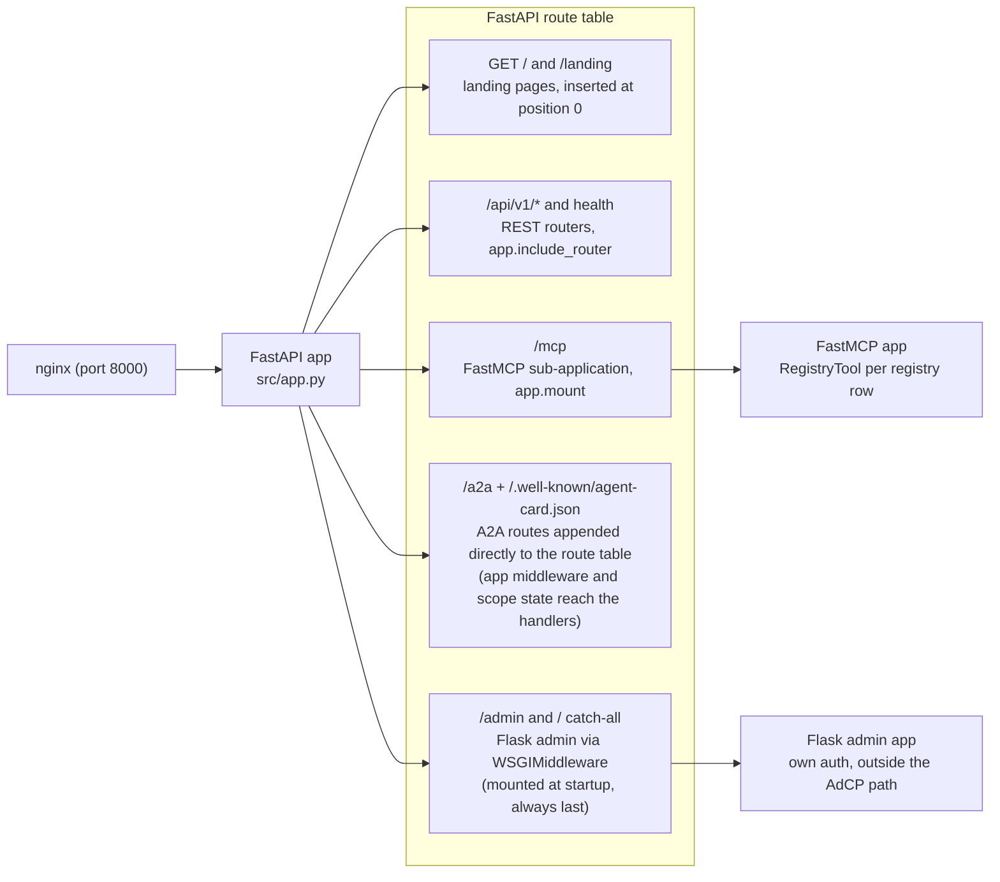
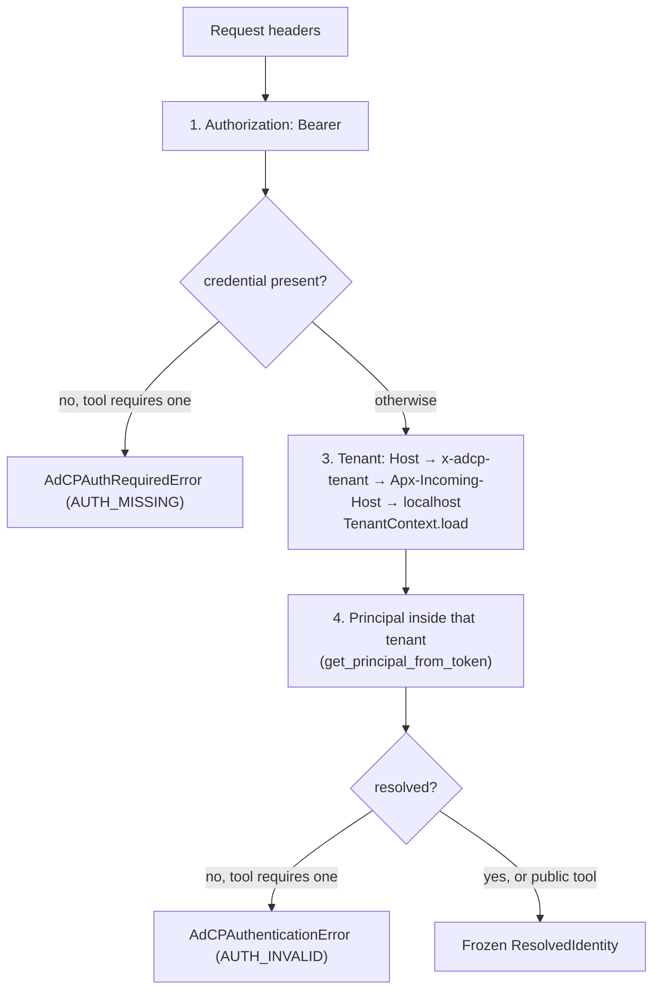
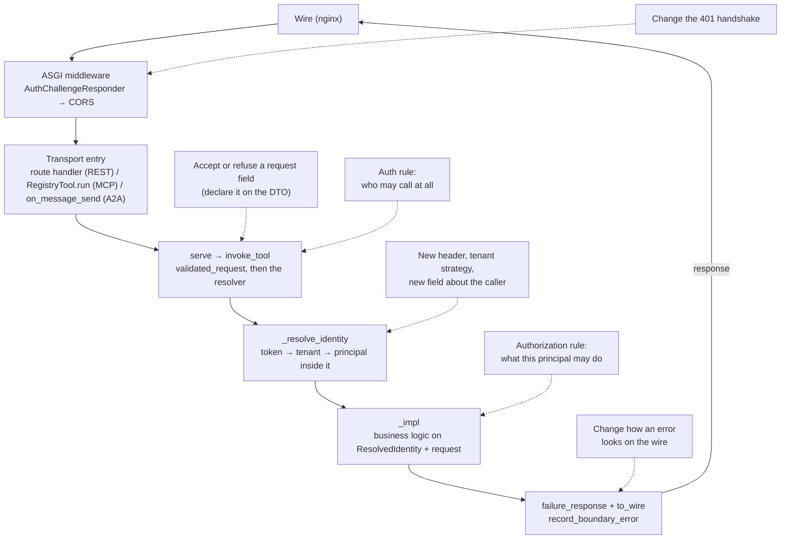

# Request lifecycle

How a request travels from the wire to business logic, and what has already
happened to it by the time your `_impl` function runs.

Read this before adding anything to the request path: a header to read, an auth
rule, a tenant-scoped check. Each of those has exactly one layer that owns it
(see [Where does my change go?](#where-does-my-change-go) at the end). The
principles this layering serves, why logic lives only in `_impl` and why
construction and serialization happen only at the boundary, are in
[architecture-principles.md](architecture-principles.md).

## One process, four entry points

A single FastAPI application, built in `src/app.py`, serves everything.
nginx sits in front (port 8000 locally) and proxies to it; there is no
per-protocol process. The app exposes four kinds of entry point:

| Path | Protocol | How it is registered |
|------|----------|----------------------|
| `/api/v1/*` | REST | FastAPI routes from `src/routes/api_v1.py` (`app.include_router`) |
| `/mcp` | MCP | FastMCP sub-application (`mcp.http_app()`), mounted with `app.mount("/mcp", mcp_app)` |
| `/a2a` + `/.well-known/agent-card.json` | A2A (JSON-RPC) | a2a-sdk route factories, appended **directly** to the FastAPI app's route table, not mounted as a sub-app, so the app's middleware and `scope["state"]` are visible to A2A handlers |
| `/admin` and `/` (catch-all) | Admin UI | The Flask admin app (`src.admin.app.create_app`), wrapped in `WSGIMiddleware` and mounted into FastAPI |

How each entry point reaches the shared application, and which of them are
sub-applications rather than plain routes on the app itself:



Two details deserve attention:

- **The admin UI is a Flask app living inside the FastAPI app.** The lifespan
  hook mounts it at startup (via `_install_admin_mounts()`) rather than at
  import time, which guarantees that the root catch-all mount is the *last*
  route: every FastAPI route, including routes added later, gets a chance to
  match before the Flask catch-all receives the request. Admin authentication
  (Google OAuth sessions) is Flask's own and is not part of the AdCP request
  path this document traces.
- **Landing pages** for `GET /` and `GET /landing` are inserted at position 0
  of the route table, so they take precedence over the root Flask mount. They
  resolve the tenant from the `Host` header and render a tenant landing page.

The app includes the health routes (`src/routes/health.py`) alongside the REST
router.

## The ASGI middleware stack

`src/app.py` registers two HTTP middleware classes on the root app, and neither
of them reads a credential or resolves an identity:

1. **`AuthChallengeResponder`** (`src/core/auth_middleware.py`), outermost. It
   sees the *finished* response of every transport, including the MCP mount
   and the A2A routes. When the JSON body carries an AdCP `AUTH_MISSING` or
   `AUTH_INVALID` envelope, it lifts the status to `401` and attaches the
   `WWW-Authenticate: Bearer` challenge (RFC 6750). It is the only place a
   401 challenge is written, so no transport can grow its own.
2. **`CORSMiddleware`**: adds CORS headers to all responses (origins from
   `ALLOWED_ORIGINS`).

> **Warning:** Starlette's `add_middleware` makes the last-registered
> middleware the outermost one. `AuthChallengeResponder` is registered last in
> the file so that it runs outermost on the wire.

There is no auth middleware. Each transport hands the request headers to the
boundary, and the resolver behind it is the one reader of a credential.

## Identity: `_resolve_identity`

All three transports converge on one function before business logic runs:

```
_resolve_identity(headers, *, require_valid_token, protocol) -> ResolvedIdentity
```

(`src/core/resolved_identity.py`.) The leading underscore is the design: this is
the one identity resolution in the tree, `invoke_tool` in
`src/core/tools/_boundary.py` is its only caller, and `ruff-boundary.toml`
bans importing it anywhere else. It reads the headers once and does four
things, in order:

**1. Token extraction** (`_extract_auth_token`): the Bearer value of
`Authorization`, or nothing. This is the only header a credential is read
from. The `x-adcp-auth` alias is not recognized: pinned 3.1.1
`L2/authentication.mdx` says the credential MUST ride `Authorization` and
sellers MUST NOT require non-canonical aliases.

**2. Missing credential**: if the tool requires a credential and none was
presented, raise `AdCPAuthRequiredError` (`AUTH_MISSING`). This runs before
tenant detection, so an anonymous caller costs no database lookups.

**3. Tenant detection and load** (`_detect_tenant`, then
`TenantContext.load`): four strategies identify the tenant_id, first match
wins, and only then is the row loaded once:

1. `Host` header: virtual-host lookup, then subdomain extraction
   (`<subdomain>.<domain>`; `localhost`, `www`, `admin` and the service's own
   name are excluded).
2. `x-adcp-tenant` header (set by nginx for path-based routing): subdomain
   lookup, then the literal tenant id.
3. `Apx-Incoming-Host` header (Approximated.app virtual hosts): virtual-host
   lookup.
4. Localhost fallback: the `default` tenant.

**4. Principal resolution** (`get_principal_from_token` in
`src/core/auth_utils.py`): the token is looked up *inside the detected
tenant*, never globally. A principal is a row in exactly one tenant, so
without a tenant there is no lookup. If the tool requires a credential and
the presented one resolves to no principal of that tenant, raise
`AdCPAuthenticationError` (`AUTH_INVALID`). A public tool (`auth: "optional"`
on its registry row) raises neither: a rejected credential is treated as
absent and the request proceeds anonymously.



The result is a frozen `ResolvedIdentity` with four fields: `principal` (a
`Principal`, or `None` on a public tool called anonymously), `tenant` (a
`TenantContext`, or `None` when no strategy matched), `protocol` (a label for
the observability record), and `account_id` (populated by
`enrich_identity_with_account` when the request body carries an
`AccountReference`). `principal_id` and `tenant_id` are derived properties.
Business logic receives this object and nothing transport-specific.

Whether the credential must verify is the **tool's** declaration
(`ToolSpec.requires_credential()` in `src/core/tools/registry.py`), handed
down by the boundary. No transport decides it, which is what keeps the three
transports from answering the same probe three ways.

### Server-initiated work: `identity_of`

Two jobs run with no request at all: executing a media buy after a human
approved it, and the delivery scheduler reporting on stored buys. They act on
behalf of the stored row's owner, and the row carries the same two facts the
request path derives, `tenant_id` and `principal_id`. `identity_of(tenant_id,
principal_id)` in `src/core/resolved_identity.py` is the same resolution with
those ids as its input: load the tenant, load the principal inside it, build
the same `ResolvedIdentity`. A missing tenant or principal there is broken
seller data (`AdCPConfigurationError`), not an authentication outcome. It is
never called by a transport.

## The boundary: `serve` and `invoke_tool`

Every transport makes one call:

```python
response = await serve(tool_name, raw_payload, headers, protocol)
```

`serve` (`src/core/tools/_boundary.py`) validates the payload into the
registry row's DTO (`validated_request`) and hands the result to
`invoke_tool`, which:

1. Captures the buyer's `context` object, to stamp it back on the response
   unchanged.
2. Resolves the identity with `_resolve_identity`, passing the row's
   `requires_credential()`.
3. Resolves the account the request names (`enrich_identity_with_account`),
   honours the request's `idempotency_key` (replay lookup before, cache
   after), and calls the implementation as `impl(req=..., identity=...)`.
4. Turns any exception, from either step, into an `AdcpFailure` carrying the
   `AdcpErrorResponse` that answers it (`failure_response`), after recording
   the original exception with `record_boundary_error`
   (`src/core/tool_error_logging.py`). The body carries no exception text.

Validation is where the accepted shape is decided: the DTO's declared fields,
and nothing else (CLAUDE.md critical pattern 7). In development an undeclared
field is a hard `INVALID_REQUEST`; in production it is stripped so a newer
buyer is served rather than refused.

## The path per transport

Each transport adds exactly one thing: its own wire marker for a failure. The
body is the response the boundary built, serialized by `to_wire`
(`src/core/tools/_wire.py`) on success and failure alike.

### REST

```
wire → AuthChallengeResponder → CORS → route handler → serve → _impl
```

The route factory in `src/routes/api_v1.py` builds one handler per registry
row. The handler reads the JSON body, merges templated path values over it
(the URL is the resource identity, so a path value wins), and calls `serve`
with `request.headers`. A success is a `200` with the wire body; an
`AdcpFailure` is answered with the failure response's own `http_status`.

### MCP

```
wire → AuthChallengeResponder → CORS → /mcp mount → FastMCP → RegistryTool.run → serve → _impl
```

`RegistryTool` (`src/core/main.py`) is one registry row served over MCP. Its
`run` reads the request headers with FastMCP's `get_http_headers` and calls
`serve` with the buyer's argument object. It is a `Tool` subclass rather than
a function tool so that FastMCP does not validate the arguments against a
signature-derived adapter first; the DTO's own JSON Schema is what the tool
advertises, and `serve` is the one validation. A failure is raised as
`AdCPToolError` carrying the wire body, which FastMCP marks `isError: true`.

### A2A

```
wire → AuthChallengeResponder → CORS → /a2a route → AdCPRequestHandler.on_message_send
     → _dispatch_skill → serve → _impl → to_wire
```

The A2A JSON-RPC routes are plain routes on the FastAPI app. The SDK's default
context builder places `dict(request.headers)` on the call context's
`state["headers"]`, which is all `on_message_send`
(`src/a2a_server/adcp_a2a_server.py`) reads before handing the skill name,
its parameters and those headers to `_dispatch_skill`. `_dispatch_skill`
refuses an unknown skill with `MethodNotFoundError` and otherwise calls
`serve`. A failure from business logic becomes a **failed Task** whose
artifact carries the AdCP envelope; the Task state is the response's own
`status`. `AuthChallengeResponder` reads the auth code off that artifact, so
the 401 handshake needs no branch in the handler.

The agent card at `/.well-known/agent-card.json` is served by a dynamic route
that rewrites the advertised A2A URL per tenant from the `Host` /
`Apx-Incoming-Host` headers (trusting `X-Forwarded-Proto` for the scheme).

## Where the path ends: the `_impl` handoff

Everything in the preceding sections exists to produce two things: a validated
request object and a `ResolvedIdentity`. At that point the transport's job is
done and Critical Pattern #5 ([CLAUDE.md](../../CLAUDE.md), and
[patterns-reference.md](patterns-reference.md)) takes over:

- The boundary calls the `_impl` function with the request and the
  `ResolvedIdentity`, never a `Context` or raw headers.
- `_impl` is transport-agnostic: zero imports from fastmcp/a2a/starlette/
  fastapi, raises typed `AdCPSalesAgentError` subclasses, returns model
  objects. It reads the caller through `require_principal` and
  `require_tenant` (`src/core/auth.py`); on a protected tool both are
  guaranteed by the resolver's postcondition, so a `None` there is an
  invariant breach, not a request to refuse.
- The boundary translates the result and any error back into the transport's
  wire format (REST status, MCP `isError` tool error, A2A failed Task),
  symmetrically, through `failure_response` and `to_wire`.

Structural guards enforce this boundary
([structural-guards.md](structural-guards.md)):
`test_transport_agnostic_impl.py`, the `ToolImpl` protocol on `ToolSpec.impl`
(mypy) with `.ast-grep/rules/impl-signature-is-request-and-identity.yml`,
`.ast-grep/rules/resolved-identity-constructed-only-by-its-owners.yml`,
`.ast-grep/rules/context-is-written-by-the-boundary-alone.yml` (no `context=`
keyword outside the boundary; `AdcpResponse` refuses the field on construction
and assignment), and `ruff-boundary.toml`'s TID251 bans on `ToolError`, on
`ContextObject` outside the schemas and the boundary, and on the two auth errors
outside the resolver and `require_*`.

## Where does my change go?

The end-to-end path with the common insertion points (dashed) attached to the
layer that owns each one; the table maps specific changes onto the same layers:



| Change you want to make | It belongs in | Not in |
|---|---|---|
| Read a new HTTP header for all transports | `_resolve_identity` / `_detect_tenant` in `src/core/resolved_identity.py`; headers reach the resolver from every transport | `_impl` (never sees headers), a transport entry |
| Accept a request field | Declare it on the DTO; `validated_request` accepts exactly the declared shape | Route handlers, tool wrappers, `_impl` |
| Add an auth rule (who may call at all) | The registry row's `auth` declaration (`src/core/tools/registry.py`), read by `invoke_tool` | A transport entry, or a check inside `_impl` |
| Add an authorization rule (what this principal may do) | `_impl`, using `ResolvedIdentity` (`require_principal`, `require_tenant` in `src/core/auth.py`) | Middleware (too early, no business context) |
| Add a tenant-resolution strategy | `_detect_tenant` in `src/core/resolved_identity.py` | Per-transport code |
| Add a field to what business logic knows about the caller | `ResolvedIdentity` + populate it in `_resolve_identity` and `identity_of` | Passing extra transport args into `_impl` |
| Change how an error looks on the wire | `failure_response` (`src/core/tools/_boundary.py`) and `to_wire`; the 401 handshake in `AuthChallengeResponder` | `_impl` (raises typed errors, nothing else), a transport entry |
| Add a REST endpoint for an existing tool | The row's `rest` declaration in `src/core/tools/registry.py`; `src/routes/api_v1.py` derives the route | A hand-written route |
| Log/audit a boundary event | `record_boundary_error` (errors) or the boundary itself | `_impl` |
| Touch request/response bodies globally | An ASGI middleware in `src/app.py`; remember that the last registered middleware is outermost | Route handlers |
